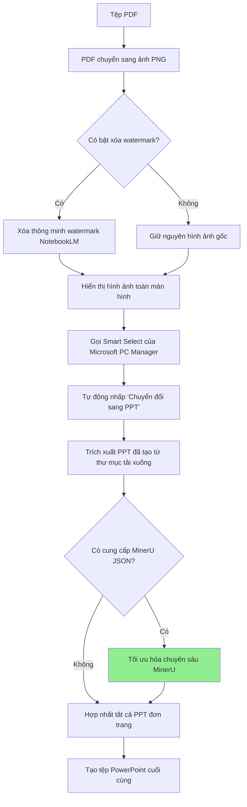

# Nguyên lý hoạt động

Tài liệu này mô tả chi tiết các chi tiết triển khai kỹ thuật và nguyên lý hoạt động của NotebookLM2PPT, phù hợp cho nhân viên kỹ thuật tham khảo.

## Quy trình làm việc cốt lõi

NotebookLM2PPT mô phỏng thao tác thủ công để thực hiện quy trình chuyển đổi PDF sang PPT hiệu quả:



## Cấu trúc dự án

```text
NotebookLM2PPT/
├── main.py                          # Điểm vào chính của chương trình
├── requirements.txt                 # Danh sách phụ thuộc
├── notebooklm2ppt/                  # Gói cốt lõi
│   ├── __init__.py                  # Tệp khởi tạo gói
│   ├── pdf2png.py                   # Mô-đun PDF sang PNG
│   ├── ppt_combiner.py              # Mô-đun hợp nhất PPT
│   └── utils/                       # Mô-đun tiện ích
│       ├── __init__.py              # Tệp khởi tạo gói
│       ├── screenshot_automation.py # Mô-đun tự động hóa chụp màn hình
│       ├── image_viewer.py          # Mô-đun xem hình ảnh
│       ├── image_inpainter.py       # Mô-đun sửa chữa hình ảnh
│       └── ppt_refiner.py           # Mô-đun tối ưu hóa MinerU
├── examples/                        # Nơi lưu trữ PDF mẫu
└── workspace/                       # Tệp tạm thời và kết quả đầu ra khi chạy
```

## Chi tiết các mô-đun cốt lõi

### Mô-đun PDF sang PNG

**Tệp**: `notebooklm2ppt/pdf2png.py`

- **Chức năng**: Chuyển đổi tệp PDF thành hình ảnh PNG độ phân giải cao
- **Triển khai**: Sử dụng thư viện `pdf2image`
- **Đặc điểm chính**:
  - Hỗ trợ tham số DPI tùy chỉnh (mặc định 200)
  - Xử lý hàng loạt PDF nhiều trang
  - Tự động tạo thư mục đầu ra
- **Chi tiết kỹ thuật**:
  - Sử dụng engine render PDF để đảm bảo hoàn nguyên chính xác văn bản và hình ảnh
  - Hỗ trợ đặt giá trị DPI khác nhau để cân bằng chất lượng và tốc độ
  - Tự động xử lý kích thước và hướng trang

### Mô-đun sửa chữa hình ảnh

**Tệp**: `notebooklm2ppt/utils/image_inpainter.py`

- **Chức năng**: Tự động nhận diện và xóa watermark NotebookLM
- **Triển khai**: Nhiều thuật toán sửa chữa hình ảnh
- **Đặc điểm chính**:
  - Tự động phát hiện vị trí watermark
  - Hỗ trợ 6 thuật toán sửa chữa khác nhau
  - Giữ chất lượng hình ảnh đồng thời xóa watermark
- **Chi tiết kỹ thuật**:
  - Nhận diện pixel cạnh của vùng watermark
  - Lấp đầy dần dần từ cạnh vào trong
  - Sử dụng thuật toán phù hợp để tính giá trị lấp đầy

### Mô-đun tự động hóa chụp màn hình

**Tệp**: `notebooklm2ppt/utils/screenshot_automation.py`

- **Chức năng**: Mô phỏng thao tác người dùng, thực hiện quy trình chuyển đổi tự động
- **Triển khai**: Sử dụng thư viện mô phỏng chuột và bàn phím
- **Đặc điểm chính**:
  - Mô phỏng phím tắt (Ctrl + Shift + A)
  - Tự động định vị và nhấp nút "Chuyển đổi sang PPT"
  - Hỗ trợ hiệu chuẩn vị trí nút
- **Chi tiết kỹ thuật**:
  - Nhận diện thông minh vị trí nút
  - Ghi lại offset dọc của nút so với đáy màn hình
  - Cơ chế xử lý lỗi tích hợp

### Mô-đun xem hình ảnh

**Tệp**: `notebooklm2ppt/utils/image_viewer.py`

- **Chức năng**: Hiển thị toàn màn hình hình ảnh đã chuyển đổi
- **Triển khai**: Sử dụng Tkinter
- **Đặc điểm chính**:
  - Hiển thị hình ảnh toàn màn hình
  - Hỗ trợ tỷ lệ hiển thị tùy chỉnh
  - Hỗ trợ phím ESC toàn cục
- **Chi tiết kỹ thuật**:
  - Tự động thích ứng kích thước màn hình
  - Hỗ trợ các độ phân giải màn hình khác nhau

### Mô-đun hợp nhất PPT

**Tệp**: `notebooklm2ppt/ppt_combiner.py`

- **Chức năng**: Hợp nhất các PPT đơn trang thành bản trình chiếu hoàn chỉnh
- **Triển khai**: Sử dụng PowerPoint Automation API
- **Đặc điểm chính**:
  - Tự động phát hiện tệp PPT tạm thời trong thư mục tải xuống
  - Hợp nhất slide theo thứ tự
  - Giữ nguyên định dạng và bố cục gốc
- **Chi tiết kỹ thuật**:
  - Giám sát thư mục tải xuống, phát hiện thời gian thực tệp PPT mới tạo
  - Sử dụng PowerPoint Automation API thực hiện hợp nhất slide

### Mô-đun tối ưu hóa MinerU

**Tệp**: `notebooklm2ppt/utils/ppt_refiner.py`

- **Chức năng**: Sử dụng kết quả phân tích MinerU để tối ưu hóa chuyên sâu PPT
- **Triển khai**: Phân tích MinerU JSON và áp dụng thuật toán tối ưu hóa
- **Đặc điểm chính**:
  - Lọc hộp văn bản thông minh
  - Xử lý thống nhất phông chữ
  - Thay thế hình ảnh chất lượng cao
  - Xử lý nền thông minh
- **Chi tiết kỹ thuật**:
  - Lọc hộp văn bản liên quan dựa trên thuật toán IOU
  - Thống nhất phông chữ thành "Microsoft YaHei"
  - Trích xuất hình ảnh chất lượng cao từ JSON và thay thế
  - Xử lý nền thông minh dựa trên đa dạng cạnh và chênh lệch màu sắc

## Thuật toán cốt lõi

### Thuật toán IOU (Intersection over Union)

**Tình huống ứng dụng**: Lọc hộp văn bản trong tối ưu hóa MinerU

**Nguyên lý**:
```python
def compute_iou(boxA, boxB):
    # Tính diện tích giao nhau của hai hình chữ nhật
    xA = max(boxA[0], boxB[0])
    yA = max(boxA[1], boxB[1])
    xB = min(boxA[2], boxB[2])
    yB = min(boxA[3], boxB[3])

    interWidth = max(0, xB - xA)
    interHeight = max(0, yB - yA)
    interArea = interWidth * interHeight

    boxAArea = (boxA[2] - boxA[0]) * (boxA[3] - boxA[1])
    boxBArea = (boxB[2] - boxB[0]) * (boxB[3] - boxB[1])

    iou = interArea / float(boxAArea + boxBArea - interArea)

    return iou
```

**Cách sử dụng**:
- Tính IOU giữa hộp văn bản do MinerU nhận diện và khối nội dung PDF
- Giữ lại hộp văn bản có giá trị IOU cao (liên quan mạnh)
- Xóa hộp văn bản có giá trị IOU thấp (có thể là phần tử không liên quan)

### Thuật toán sửa chữa hình ảnh

**Tình huống ứng dụng**: Xóa watermark NotebookLM

**Danh sách thuật toán**:
1. **Làm mịn thông minh**: Hiệu quả tổng hợp tốt nhất, phù hợp hầu hết tình huống
2. **Lấp đầy trung bình cạnh**: Lấy màu trung bình pixel xung quanh để lấp đầy
3. **Lấp đầy đơn sắc siêu tốc**: Trực tiếp lấp đầy bằng màu nền đơn
4. **Sửa chữa co dần từng lớp**: Sửa chữa dần dần từ ngoài vào trong
5. **Nội suy chuyển tiếp gradient**: Tính toán chuyển tiếp bề mặt mượt mà
6. **Sửa chữa ánh sáng song điều hòa**: Giữ tính liên tục của ánh sáng

### Thuật toán phát hiện đa dạng cạnh

**Tình huống ứng dụng**: Xử lý nền thông minh trong tối ưu hóa MinerU

**Nguyên lý**:
- Tính đa dạng màu sắc cạnh của khối văn bản
- Tính chênh lệch màu sắc bốn góc của khối văn bản
- Dựa trên kết quả tính toán để phán đoán là vùng đơn sắc hay nền phức tạp
- Vùng đơn sắc lấp đầy bằng màu trung bình, nền phức tạp giữ lại nền gốc

## Tối ưu hiệu suất

### Xử lý song song

Chương trình hỗ trợ xử lý song song nhiều trang PDF, tăng đáng kể tốc độ chuyển đổi:

```python
from concurrent.futures import ThreadPoolExecutor

def process_pages(pages):
    with ThreadPoolExecutor(max_workers=4) as executor:
        results = list(executor.map(process_single_page, pages))
    return results
```

### Cơ chế cache

Để tránh tính toán lặp lại, chương trình triển khai cơ chế cache:

- Cache kết quả PDF sang PNG
- Cache kết quả phát hiện watermark
- Cache kết quả phân tích MinerU JSON
- Cache tải xuống hình ảnh

### Quản lý bộ nhớ

Đối với tệp PDF lớn, chương trình áp dụng chiến lược xử lý theo khối:

- Mỗi lần chỉ xử lý một số lượng trang nhất định
- Giải phóng kịp thời tài nguyên không còn sử dụng
- Tránh tràn bộ nhớ

### Tối ưu phụ thuộc

Trong phiên bản v0.6.0, chương trình đã thực hiện tối ưu phụ thuộc chuyên sâu:

- **Loại bỏ Scikit-learn**: Thay thế phát hiện đa dạng cạnh DBSCAN ban đầu bằng triển khai Numpy hiệu suất cao
- **Loại bỏ OpenCV**: Engine hiển thị hình ảnh toàn màn hình chuyển hoàn toàn sang Tkinter
- **Lợi ích về kích thước**: Kích thước tệp .exe hoặc binary sau biên dịch giảm đáng kể, tốc độ khởi động lạnh và chiếm dụng bộ nhớ được tối ưu lớn

## Tham số kỹ thuật quan trọng

| Tham số | Giá trị mặc định | Tác dụng | Ảnh hưởng |
|---------|-------------------|----------|-----------|
| **button_offset** | 0 | Offset nút Smart Select | Quyết định chương trình có thể định vị nút chính xác không |
| **dpi** | 200 | Độ phân giải PDF sang PNG | Ảnh hưởng chất lượng hình ảnh và tốc độ chuyển đổi |
| **display_scale** | 0.8 | Tỷ lệ hiển thị hình ảnh | Ảnh hưởng hiệu quả chọn vùng và tỷ lệ chuyển đổi thành công |
| **delay** | 2 giây | Độ trễ thao tác | Ảnh hưởng tính ổn định thao tác và tốc độ chuyển đổi |
| **timeout** | 60 giây | Thời gian chờ | Ảnh hưởng tính ổn định và hiệu quả chuyển đổi |

## Benchmark hiệu suất

### Tốc độ chuyển đổi

| Số trang PDF | Chuyển đổi cơ bản | Tối ưu hóa MinerU |
|-------------|--------------------|--------------------|
| 10 trang    | ~2 phút            | ~3 phút            |
| 20 trang    | ~4 phút            | ~6 phút            |
| 50 trang    | ~10 phút           | ~15 phút           |

### Sử dụng tài nguyên

| Loại tài nguyên | Chuyển đổi cơ bản | Tối ưu hóa MinerU |
|-----------------|--------------------|--------------------|
| CPU             | 30-50%             | 40-60%             |
| Bộ nhớ          | 500MB              | 1GB                |
| Ổ đĩa           | 100MB              | 500MB              |

## Tài liệu liên quan

- [Tối ưu hóa MinerU](mineru): Tìm hiểu chi tiết triển khai kỹ thuật tối ưu hóa chuyên sâu MinerU
- [Giới thiệu tính năng](features): Tìm hiểu các tính năng cốt lõi của công cụ
- [Bắt đầu nhanh](quickstart): Hướng dẫn bắt đầu nhanh
